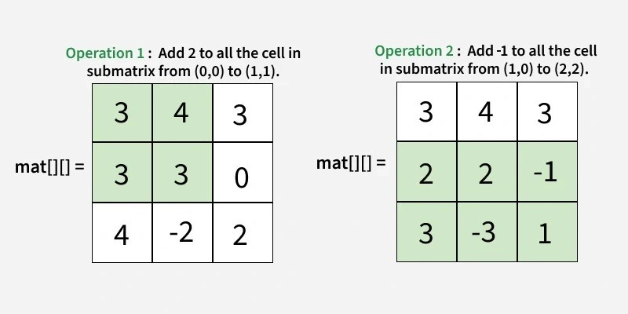

# **2D Difference Array**

## Problem Statement
You are given a 2D integer matrix mat[][] of size n × m and a list of q operations opr[][]. Each operation is represented as an array [v, r1, c1, r2, c2], where:

  - v is the value to be added
  - (r1, c1) is the top-left cell of a submatrix
  - (r2, c2) is the bottom-right cell of the submatrix (inclusive)

For each of the q operations, add v to every element in the submatrix from (r1, c1) to (r2, c2). Return the final matrix after applying all operations.
---

## **Examples :**


**Input:** mat[][] = [[1, 2, 3],  opr[][] = [[2, 0, 0, 1, 1], [-1, 1, 0, 2, 2]]
                [1, 1, 0],
                [4,-2, 2]]

**Output:** [[3, 4, 3],
        [2, 2, -1],
        [3, -3, 1]] 

**Explanation:**




---


## 
- 1 ≤ n×m, q ≤ 10^5
- 0 ≤ r1 ≤ r2 ≤ n - 1
- 0 ≤ c1 ≤ c2 ≤ m - 1
- -104 ≤ mat[i][j], v ≤ 10^4
---

### **✅ Steps to Solve:**

1. **Create a `diff` matrix** of size `(n+1) x (m+1)` initialized to 0.

2. **For each operation `[v, r1, c1, r2, c2]`**, update `diff` matrix using:

   * `diff[r1][c1] += v`
   * `diff[r1][c2+1] -= v`
   * `diff[r2+1][c1] -= v`
   * `diff[r2+1][c2+1] += v`

3. **Apply prefix sums**:

   * First row-wise
   * Then column-wise

4. **Update the original matrix**:

   * `mat[i][j] += diff[i][j]`

5. **Return the updated matrix**.


---


## 🐍 Python Solution

```python
class Solution:
    def applyDiff2D(self, mat, opr):
        n, m = len(mat), len(mat[0])
        diff = [[0] * (m + 1) for _ in range(n + 1)]

        for v, r1, c1, r2, c2 in opr:
            diff[r1][c1] += v
            if c2 + 1 < m:
                diff[r1][c2 + 1] -= v
            if r2 + 1 < n:
                diff[r2 + 1][c1] -= v
            if r2 + 1 < n and c2 + 1 < m:
                diff[r2 + 1][c2 + 1] += v

        for i in range(n):
            for j in range(1, m):
                diff[i][j] += diff[i][j - 1]

        for j in range(m):
            for i in range(1, n):
                diff[i][j] += diff[i - 1][j]

        for i in range(n):
            for j in range(m):
                mat[i][j] += diff[i][j]

        return mat


```
## ☕️ Java Solution

```java
class Solution {
    public ArrayList<ArrayList<Integer>> applyDiff2D(int[][] mat, int[][] opr) {
        int n = mat.length, m = mat[0].length;
        int[][] diff = new int[n + 1][m + 1];

        for (int[] op : opr) {
            int v = op[0], r1 = op[1], c1 = op[2], r2 = op[3], c2 = op[4];
            diff[r1][c1] += v;
            if (c2 + 1 < m) diff[r1][c2 + 1] -= v;
            if (r2 + 1 < n) diff[r2 + 1][c1] -= v;
            if (r2 + 1 < n && c2 + 1 < m) diff[r2 + 1][c2 + 1] += v;
        }

        for (int i = 0; i < n; i++)
            for (int j = 1; j < m; j++)
                diff[i][j] += diff[i][j - 1];

        for (int j = 0; j < m; j++)
            for (int i = 1; i < n; i++)
                diff[i][j] += diff[i - 1][j];

        ArrayList<ArrayList<Integer>> result = new ArrayList<>();
        for (int i = 0; i < n; i++) {
            ArrayList<Integer> row = new ArrayList<>();
            for (int j = 0; j < m; j++) {
                row.add(mat[i][j] + diff[i][j]);
            }
            result.add(row);
        }

        return result;
    }
}


```
<p align="center">
  

</p>
