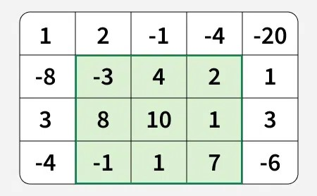

# **Maximum sum Rectangle**

## Problem Statement

Given a 2D matrix `mat[][]` with dimensions n×m. Find the maximum possible `sum` of any `submatrix` within the given matrix.

---

## **Examples :**

**Input:** mat[][] = [[1, 2, -1, -4, -20], [-8, -3, 4, 2, 1], [3, 8, 10, 1, 3], [-4, -1, 1, 7, -6]]

**Output:** 29

**Explanation:** The matrix is as follows and the green rectangle denotes the maximum sum rectangle which is equal to 29.



---


```bash
Input: mat[][] = [[-1, -2], [-3, -4]]

Output: -1

Explanation: Taking only the first cell is the optimal choice.

```

---

## Constraints:
- 1 ≤ mat.size() ≤ 900
- 0 ≤ mat[i][j] ≤ 10^6

---

### **✅ Steps to Solve:**

1. **Initialize** `max_sum` as negative infinity.

2. **Loop over all pairs of rows**:
   For each pair `(top, bottom)` from `0` to `n-1`:

3. **Compress rows into 1D array**:
   Create a temporary array `temp[]` of size `m`.
   For each column `i`, do `temp[i] += matrix[bottom][i]`.

4. **Apply Kadane’s Algorithm** on `temp[]`:
   This gives the maximum subarray sum for the current row range.

5. **Update** `max_sum` if the current Kadane result is greater.

6. **Return** `max_sum` after all iterations.


---


## 🐍 Python Solution

```python
class Solution:
    def maxRectSum(self, mat):
        if not mat or not mat[0]:
            return 0

        n = len(mat)
        m = len(mat[0])
        max_sum = float('-inf')

        for top in range(n):
            temp = [0] * m

            for bottom in range(top, n):
                for col in range(m):
                    temp[col] += mat[bottom][col]

                # Apply Kadane's Algorithm to temp[]
                max_sum = max(max_sum, self.kadane(temp))

        return max_sum

    def kadane(self, arr):
        max_ending_here = max_so_far = arr[0]
        for x in arr[1:]:
            max_ending_here = max(x, max_ending_here + x)
            max_so_far = max(max_so_far, max_ending_here)
        return max_so_far

```
## ☕️ Java Solution

```java
class Solution {
    public int maxRectSum(int[][] mat) {
        int n = mat.length;
        int m = mat[0].length;
        int maxSum = Integer.MIN_VALUE;

        for (int top = 0; top < n; top++) {
            int[] temp = new int[m];

            for (int bottom = top; bottom < n; bottom++) {
                for (int col = 0; col < m; col++) {
                    temp[col] += mat[bottom][col];
                }

                int currMax = kadane(temp);
                maxSum = Math.max(maxSum, currMax);
            }
        }

        return maxSum;
    }

    private int kadane(int[] arr) {
        int maxEndingHere = arr[0];
        int maxSoFar = arr[0];

        for (int i = 1; i < arr.length; i++) {
            maxEndingHere = Math.max(arr[i], maxEndingHere + arr[i]);
            maxSoFar = Math.max(maxSoFar, maxEndingHere);
        }

        return maxSoFar;
    }
}

```
<p align="center">
  

</p>
