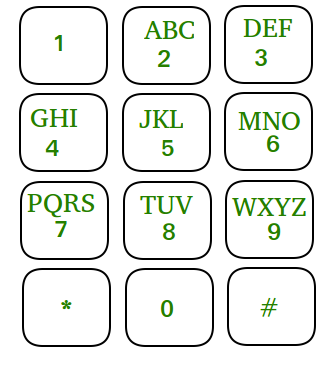

# Mobile numeric keypad


## Problem Statement
There is a standard `numeric keypad` on a mobile phone. You can press the `current button` or any button that is directly `above, below`, to the `left`, or to the `right` of it. For example, if you press `5`, then pressing `2`, `4`, `6`, or `8` is allowed. However, `diagonal movements` and pressing the `bottom row corner` buttons (`*` and `#`) are not allowed.



Given an integer `n`, determine how many `unique` sequences of length `n` can be formed by pressing buttons on the keypad, starting from any digit.

---

## **Examples :**

**Input:** n = 1

**Output:** 10

**Explanation:** Possible 1-digit numbers follow keypad moves - From 0 → 0, 1 → 1, 2 → 2 and so on, total **10** valid combinations are possible.

---

**Input:** n = 2

**Output:** 36

**Explanation:** Possible 2-digit numbers follow keypad moves -

From 0 → 00, 08 (2), 

From 1 → 11, 12, 14 (3),

From 3 → 33, 32, 36 (3), and so on,

total **36** valid combinations are possible.


### **✅ Steps to Solve "Mobile Numeric Keypad" Problem (Short):**

**1.** Understand the keypad layout – only up/down/left/right/self moves allowed.

**2.** Create a map of valid moves for each digit (0–9).

**3.** Use Dynamic Programming:

  - Let `dp[i][d]` be the number of sequences of length `i` ending with digit `d`.

**4**Initialize base case:

  - For length 1, `dp[1][d] = 1` for all digits.

**5.** Fill the DP table for lengths 2 to `n` using valid moves.

**6.** Return the sum of all `dp[n][d]` for digits 0–9.


## 🐍 Python Solution

```python
class Solution:
	def getCount(self, n):
		# code here
		moves = {
            0: [0, 8],
            1: [1, 2, 4],
            2: [2, 1, 3, 5],
            3: [3, 2, 6],
            4: [4, 1, 5, 7],
            5: [5, 2, 4, 6, 8],
            6: [6, 3, 5, 9],
            7: [7, 4, 8],
            8: [8, 5, 7, 9, 0],
            9: [9, 6, 8]
        }

        dp = [[0] * 10 for _ in range(n + 1)]

        for digit in range(10):
            dp[1][digit] = 1

        for i in range(2, n + 1):
            for digit in range(10):
                for neighbor in moves[digit]:
                    dp[i][digit] += dp[i - 1][neighbor]

        return sum(dp[n][digit] for digit in range(10))

```
## ☕️ Java Solution

```java
class Solution {
    public int getCount(int n) {
        int[][] moves = {
            {0, 8},
            {1, 2, 4},
            {2, 1, 3, 5},
            {3, 2, 6},
            {4, 1, 5, 7},
            {5, 2, 4, 6, 8},
            {6, 3, 5, 9},
            {7, 4, 8},
            {8, 5, 7, 9, 0},
            {9, 6, 8}
        };

        int[][] dp = new int[n + 1][10];

        for (int digit = 0; digit <= 9; digit++) {
            dp[1][digit] = 1;
        }

        for (int len = 2; len <= n; len++) {
            for (int digit = 0; digit <= 9; digit++) {
                for (int neighbor : moves[digit]) {
                    dp[len][digit] += dp[len - 1][neighbor];
                }
            }
        }

        int total = 0;
        for (int digit = 0; digit <= 9; digit++) {
            total += dp[n][digit];
        }

        return total;
    }
}


```
<p align="center">
  

</p>
