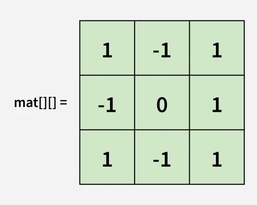
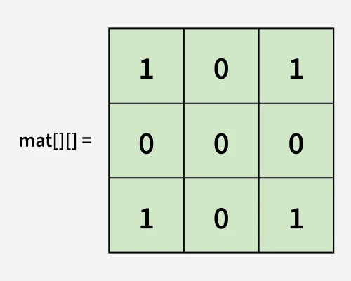

# **Set Matrix Zeros**


## **Problem Statement***
You are given a 2D matrix `mat[][]` of size `n x m`. The task is to modify the matrix such that if `mat[i][j]` is 0, all the elements in the i-th row and j-th column are set to 0.

---

## **Examples :**


---

Input: 

mat[][] = 
    
    
    
Output: 

mat[][] = 
    
    
    
Explanation: mat[1][1] = 0, so all elements in row 1 and column 1 are updated to zeroes.

---


### **Constraints:**
- 1 ≤ arr.size() ≤ 105
- 0 ≤ arr[i] ≤ 106


---

### **🧠 Steps to Solve:**

1. **Scan the matrix** to find all cells with `0`.
2. **Record** the row and column indices of those cells.

   * Use sets or arrays to keep track.
3. **Traverse the matrix again**:

   * If a cell is in a recorded row or column, set it to `0`.


---


## 🐍 Python Solution

```python
class Solution:
    def setMatrixZeroes(self, mat):
        n = len(mat)
        m = len(mat[0])
        
        zero_rows = set()
        zero_cols = set()
        
        for i in range(n):
            for j in range(m):
                if mat[i][j] == 0:
                    zero_rows.add(i)
                    zero_cols.add(j)
        
        for i in range(n):
            for j in range(m):
                if i in zero_rows or j in zero_cols:
                    mat[i][j] = 0
        
        return mat


```
## ☕️ Java Solution

```java
import java.util.HashSet;
import java.util.Set;

class Solution {
    public void setMatrixZeroes(int[][] mat) {
        int n = mat.length;
        int m = mat[0].length;

        Set<Integer> zeroRows = new HashSet<>();
        Set<Integer> zeroCols = new HashSet<>();
        for (int i = 0; i < n; i++) {
            for (int j = 0; j < m; j++) {
                if (mat[i][j] == 0) {
                    zeroRows.add(i);
                    zeroCols.add(j);
                }
            }
        }

        for (int i = 0; i < n; i++) {
            for (int j = 0; j < m; j++) {
                if (zeroRows.contains(i) || zeroCols.contains(j)) {
                    mat[i][j] = 0;
                }
            }
        }
    }
}

```
<p align="center">
  

</p>
