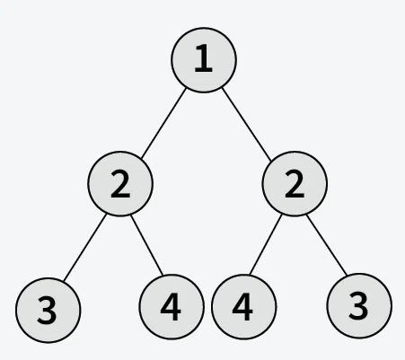
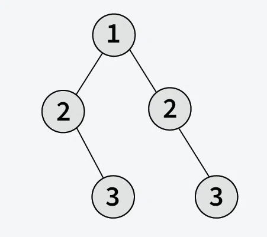

# 🌀 Symmetric Tree

## 📝 Problem Statement

 Given the root of a binary tree, check whether it is **symmetric**, i.e., whether the tree is a **mirror image of itself.** A binary tree is symmetric if the left subtree is a mirror reflection of the right subtree.

---

## Example

### 📥 Input: root[] = [1, 2, 2, 3, 4, 4, 3]

**Output:** True

**Explanation:** As the left and right half of the above tree is mirror image, tree is symmetric.

---

### 📥 Input: root[] = [1, 2, 2, N, 3, N, 3]

**Output:** False

**Explanation:** As the left and right half of the above tree is not the mirror image, tree is not symmetric. 

---

